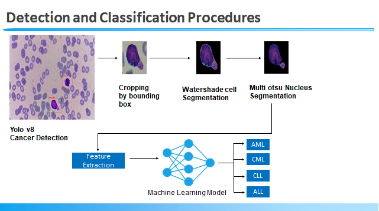
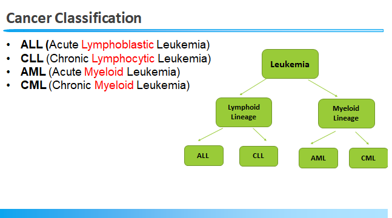
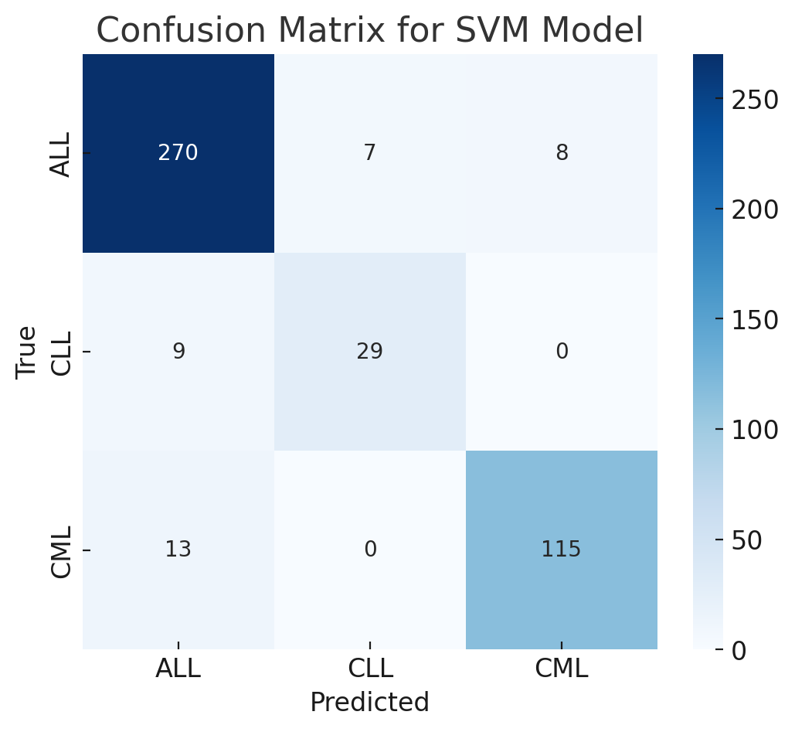

# Leukemia Detection and Classification
(On Going)

This repository aims to detect and classify different types of leukemia (ALL, AML, CLL, CML) using **machine learning** models. The classification leverages features extracted from cell images like size, shape, and chromatin density. **YOLOv8** is used for initial cancer detection, followed by segmentation and feature extraction. Various machine learning models, such as Support Vector Machines (SVM), are used for classification.

## Dataset:
  -Soon will be published with codes

## Methodology

### 1. **Detection using YOLO v8**
   - **Goal**: Detect cancerous cells in microscopy images using YOLO v8.
   - **Process**: 
     - **Image Input**: Microscopy image showing blood cells.
     - **Detection**: YOLO v8 identifies regions where cells are located by drawing bounding boxes.
     - **Image**:
        *(This image shows the process of detection using YOLO v8.)*

### 2. **Cropping by Bounding Box**
   - **Goal**: Crop the detected cells from the image for further analysis.
   - **Process**: The bounding boxes detected by YOLO are used to crop the cells.

### 3. **Watershed Cell Segmentation**
   - **Goal**: Segment individual cells.
   - **Process**: Watershed segmentation is applied to the cropped images to separate adjacent or overlapping cells.

### 4. **Multi-Otsu Nucleus Segmentation**
   - **Goal**: Segment the nucleus of each cell.
   - **Process**: Multi-Otsu segmentation method is used to distinguish the nucleus from the rest of the cell based on intensity thresholds.

### 5. **Feature Extraction**
   - **Goal**: Extract relevant features that are useful for classification.
   - **Features**: 
     - Cell Size
     - Cell Shape
     - Nucleus Shape
     - Chromatin Density
     - Nucleus-to-Cytoplasm Ratio
     - Granularity
     - Cytoplasm Texture
   - **Feature Extraction Process**:
     - Each of these features is calculated from the segmented images.

### 6. **Classification**
   - **Goal**: Classify the cells into one of the four leukemia categories:
     - **AML**: Acute Myeloid Leukemia
     - **CML**: Chronic Myeloid Leukemia
     - **CLL**: Chronic Lymphocytic Leukemia
     - **ALL**: Acute Lymphoblastic Leukemia
   - **Machine Learning Model**: Support Vector Machine (SVM) and Random Forest was used for classification.

   
   *Cancer classification hierarchy between different leukemia types.*

---

## Evaluation

### **SVM and Random Forest Classification Performance**

#### **Accuracy, Precision, Recall, and F1-Score for SVM**

| **Class**       | **Precision** | **Recall** | **F1-Score** | **Accuracy** |
|-----------------|---------------|------------|--------------|--------------|
| **Class 0 (CLL)**   | 0.92          | 0.93       | 0.93         | 0.905        |
| **Class 1**         | 0.79          | 0.68       | 0.73         |              |
| **Class 2**         | 0.91          | 0.91       | 0.91         |              |
| **Macro Average**   | 0.87          | 0.84       | 0.85         |              |
| **Weighted Average**| 0.90          | 0.90       | 0.90         |              |

| **Class**       | **Precision** | **Recall** | **F1-Score** | **Accuracy** |
|-----------------|---------------|------------|--------------|--------------|
| **Class 0 (CLL)**   | 0.92          | 0.95       | 0.94         | 0.918        |
| **Class 1**         | 0.81          | 0.76       | 0.78         |              |
| **Class 2**         | 0.93          | 0.90       | 0.92         |              |
| **Macro Average**   | 0.89          | 0.87       | 0.88         |              |
| **Weighted Average**| 0.92          | 0.92       | 0.92         |              |

#### **Confusion Matrix (SVM Model)**

Here’s the confusion matrix for the SVM model. The matrix shows how many instances from each true class were predicted as each possible class:



*The confusion matrix helps to evaluate how well the model distinguishes between the different leukemia classes.*

---

## How to Run

### 1. **Clone this repository**
```bash
git clone https://github.com/your-username/leukemia-detection.git
cd leukemia-detection
